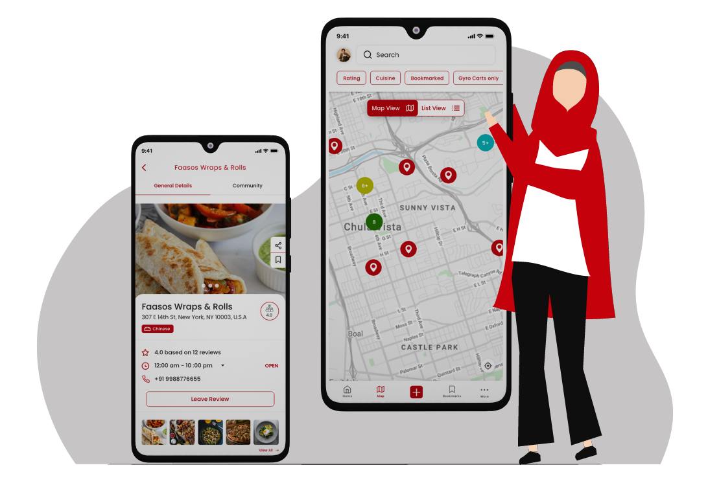
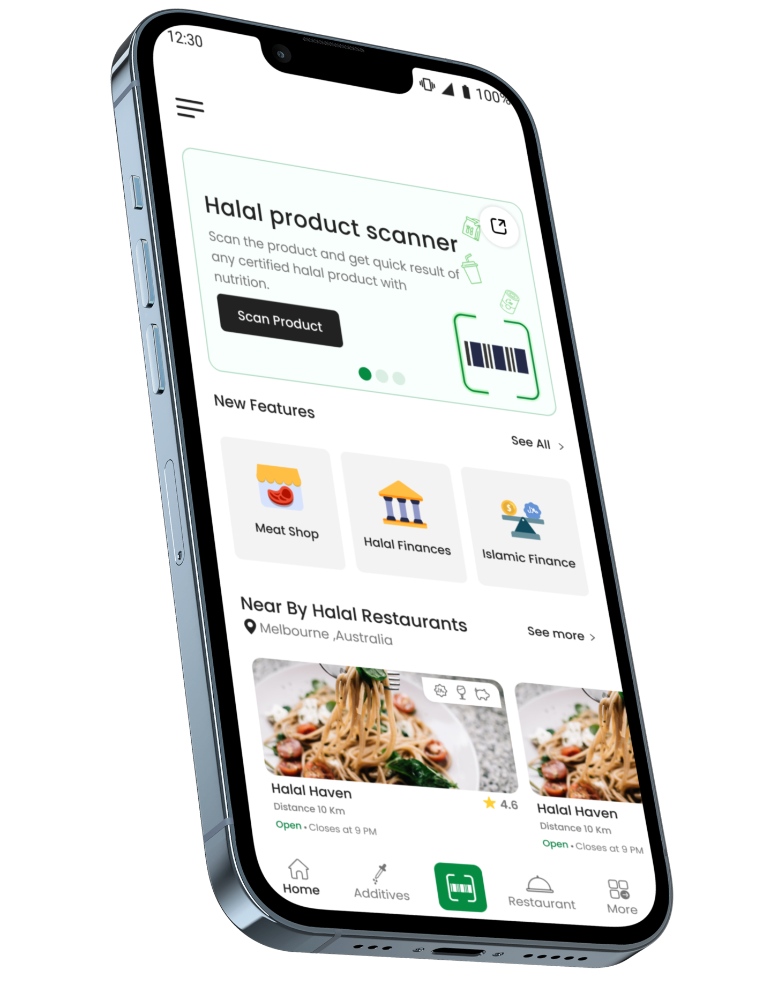
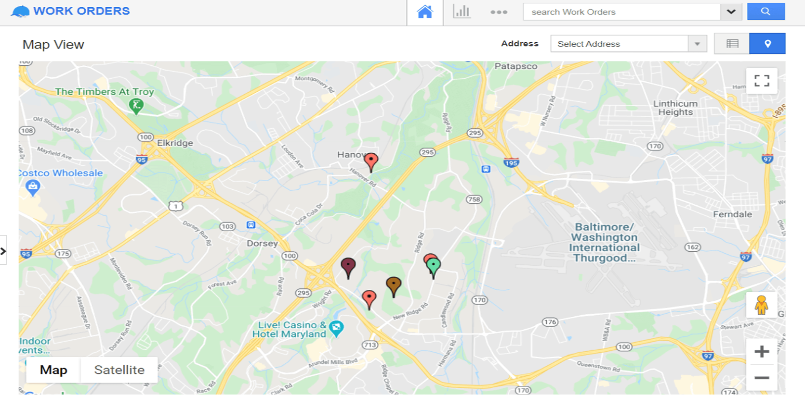
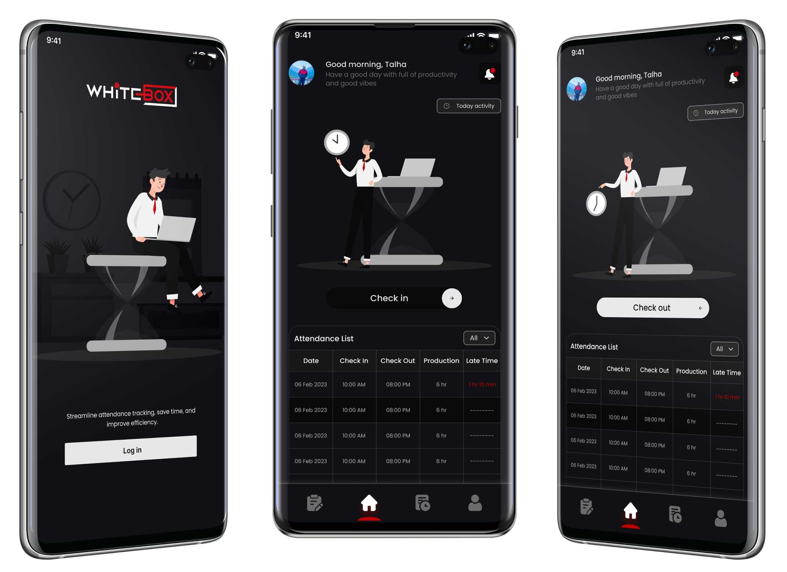
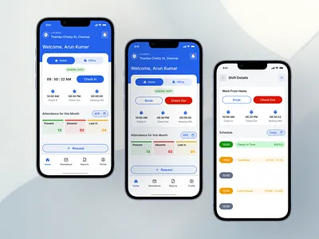
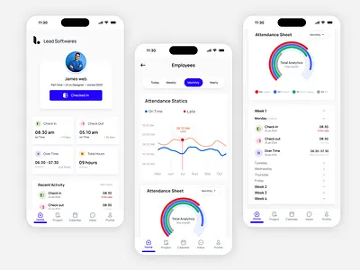
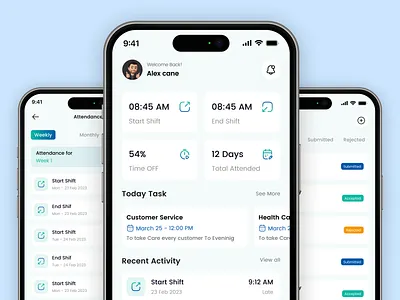
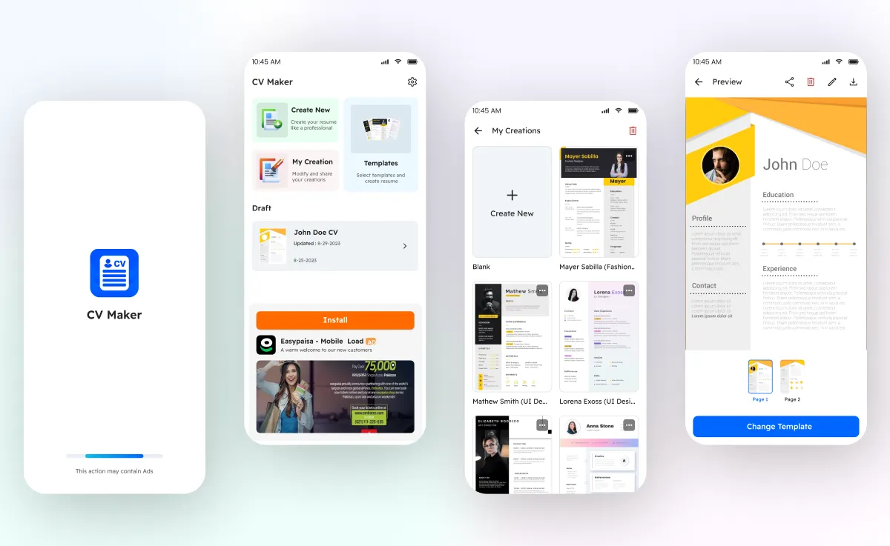
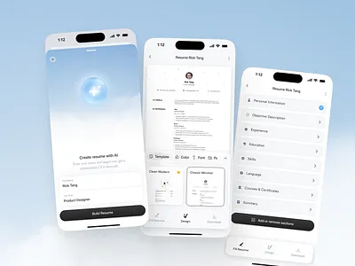
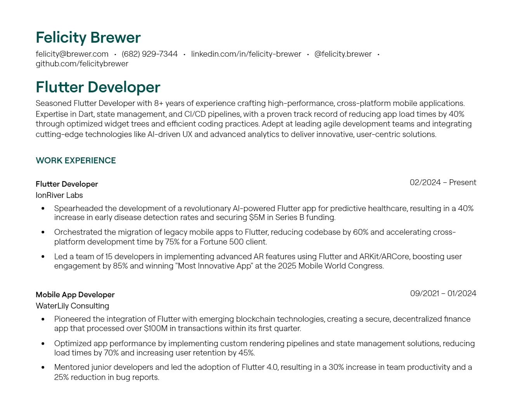

# Hi, I'm Abdul Basit 👋  

### 🚀 Flutter Developer | 3+ Years Experience | Production Mobile Apps

I’m a full-time **Flutter developer** with 3+ years of experience building and shipping production-grade mobile applications for Android and iOS.

I specialize in scalable architecture, real-time systems, Firebase integration, and performance-aware mobile app development.

---

# 📱 Featured Production Apps

---

## 🥗 HalalBite — Halal Food Discovery App

  
  
  
  

**Tech Stack:** Flutter, Firebase, Google Maps API  
- Real-time halal restaurant discovery  
- Location-based search & filtering  
- Firebase backend integration  
- Production deployment & lifecycle management  

🔗 Website: https://halalbites.co/

---

## 🏢 Attendance Management System (AMS)

  
  
  
  

**Tech Stack:** Flutter, Firebase  
- Employee attendance & reporting system  
- Admin dashboards & analytics  
- Real-time data synchronization  
- Play Store release & maintenance  

🔗 Website: https://www.whiteboxtech.net/projects/development/ams  
🔗 Play Store: https://play.google.com/store/apps/details?id=net.whiteboxtech.whitebox_ams  

---

## 📄 CV Lab — Resume Builder App

  
  
  
  

**Tech Stack:** Flutter, PDF Generation  
- Resume template system  
- PDF export functionality  
- Performance-optimized UI  
- Production Play Store release  

🔗 Play Store: https://play.google.com/store/apps/details?id=com.crewdog.cvlab  

---

# 🛠 Professional Focus

- Flutter & Dart (MVVM, Clean Architecture)
- BLoC / Provider / GetX state management
- Firebase (Auth, Firestore, Realtime DB)
- REST APIs & real-time mobile systems
- Performance optimization & scalable architecture
- Full app lifecycle: Development → Deployment → Store Release

---

# 🧠 Strengthening Core Computer Science Foundations

Alongside professional development, I’m actively deepening my core CS knowledge through hands-on implementation:

- CPU Scheduling Simulator (FCFS, SJF, Round Robin) in Python  
- Operating Systems fundamentals  
- System performance & trade-offs  
- Applied machine learning exploration  

I document my work openly to stay consistent, deepen understanding, and build strong long-term engineering fundamentals.

---

# 📫 Let's Connect

- LinkedIn: https://www.linkedin.com/in/abdul-basit-90ab64219/
- Email: malikabdulbasit43@gmail.com
