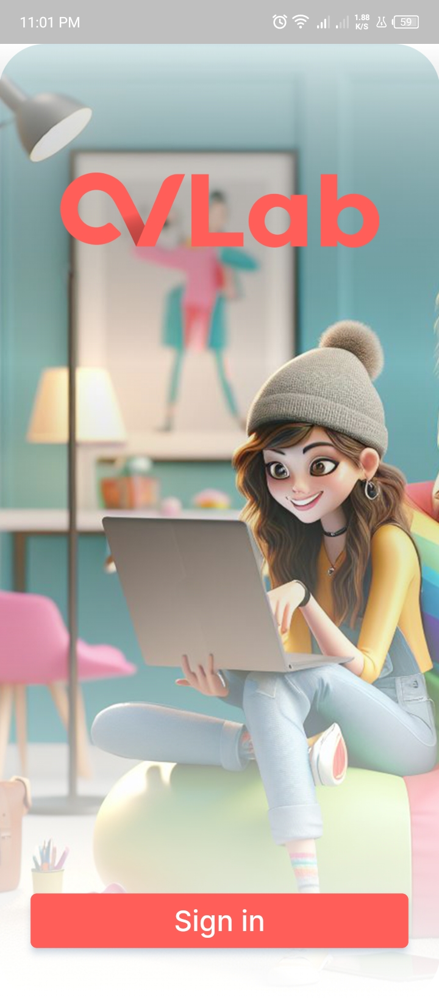
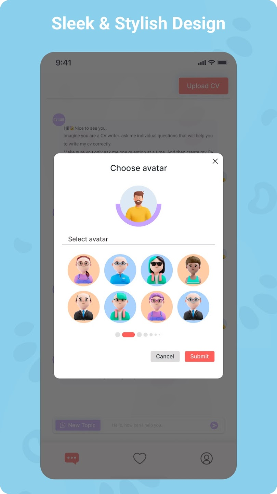
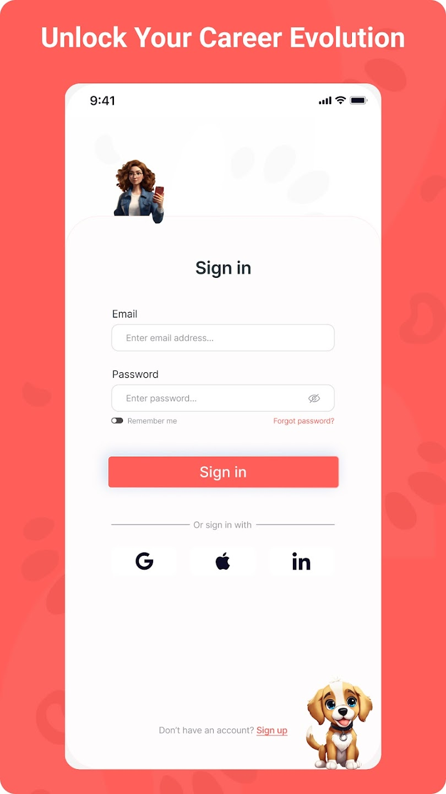
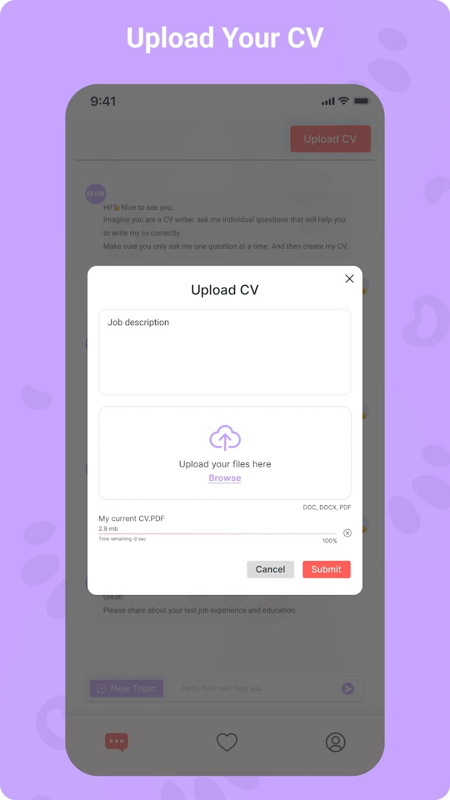

# Abdul Basit

Software Engineer focused on **Mobile Systems, Backend Infrastructure, and Applied AI**

More than 2 years of experience building and shipping **production mobile applications used by real users**.

I enjoy building systems end-to-end — from **mobile interfaces and backend services to AI-powered tools and system experiments**.

My current focus is expanding into **systems engineering and applied machine learning**, with an interest in performance, automation, and intelligent developer tooling.

---

# Production Mobile Applications

## HalalBite — Halal Food Discovery Platform

Tech Stack

Flutter  
Firebase  
Google Maps API

Highlights

- Real-time halal restaurant discovery
- Location-based search and filtering
- Firebase backend infrastructure
- Production deployment lifecycle

Website  
https://halalbites.co/

---

## Attendance Management System

Tech Stack

Flutter  
Firebase

Highlights

- Real-time employee attendance tracking
- Admin dashboards and reporting
- Play Store deployment and maintenance

Play Store  
https://play.google.com/store/apps/details?id=net.whiteboxtech.whitebox_ams

---

## CV Lab — Resume Builder

Tech Stack

Flutter  
PDF generation

Highlights

- Resume template engine
- Dynamic PDF generation
- Optimized UI rendering

Play Store  
https://play.google.com/store/apps/details?id=com.crewdog.cvlab

---

# Engineering & AI Projects

## Smart Hire AI — Resume Analysis Platform

AI-powered resume analysis system that evaluates resumes against job descriptions.

Features

- Resume vs Job Description skill matching
- ATS compatibility scoring
- AI resume summaries
- Missing skill detection
- Resume improvement suggestions

Architecture

React Dashboard  
↓  
Node.js API  
↓  
MongoDB  
↓  
HuggingFace AI models

Frontend  
https://smart-hire-dashboard.vercel.app

Backend API  
https://smart-hire-api-gutg.onrender.com

---

## CPU Scheduling Simulator

A Python simulator implementing classic **Operating System scheduling algorithms**.

Implemented Algorithms

- First Come First Serve
- Shortest Job First
- Round Robin

Focus

- Process scheduling behavior
- Waiting time analysis
- Performance trade-offs

Planned extensions

- workload simulation
- scheduling visualization
- ML-assisted scheduling prediction

---

# Technical Interests

Operating Systems  
Distributed Backend Systems  
Applied Machine Learning  
Performance Engineering  
AI-assisted Developer Tools

---

# Technologies

Mobile

Flutter  
Dart

Backend

Node.js  
Express

AI / ML

Python  
HuggingFace  
Scikit-learn (learning)

Databases

MongoDB  
Firebase

Cloud

Render  
Vercel

---

# Learning Focus

I believe strong engineers understand both **practical product development and core computer science fundamentals**.

Current focus areas

- Operating Systems
- System Design
- Applied Machine Learning
- Distributed backend systems

---

# Content

I share programming content and DSA explanations on YouTube.

YouTube  
https://www.youtube.com/@tech_stack

---

# Connect

LinkedIn  
https://linkedin.com/in/abdul-basit-90ab64219

Email  
malikabdulbasit43@gmail.com
